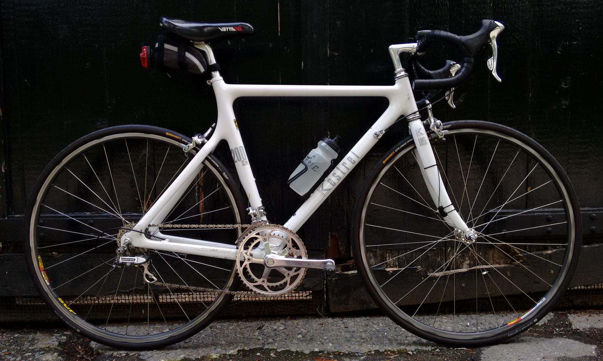

[{:width="800" height="480"}](images/kestrel-totem.jpg)

# Kestrel 200&nbsp;SC

|---------------------------|------|
| **Year**                  | 1991 |
| **Make**                  | Kestrel |
| **Model**                 | 200 SC |
| **Manufacturer**          | Cycle Composites, Inc., Santa Cruz County, California |
| **Serial&nbsp;Number**    | [17328](images/kestrel-17328.jpg) |
| **Frame**                 | One-Piece Carbon/Spectra |
| **Fork**                  | EMS Composite |
| **Drivetrain**            | Dura-Ace 8-speed SIS 13–26 HG 39/52 SG Round |

[{:style="max-width: 50%;"}](images/kestrel-lion.jpg)[{:style="max-width: 50%;"}](images/kestrel-door.jpg)

## Components

|-------------------|--------------------------------------------------|
| **Brakes**        | Shimano BR-7403 SLR-S, Dura-Ace (39–49 mm reach) |
| **Cassette**      | Shimano CS-7401-8, Dura-Ace (Hyperglide 8-speed 13–26) |
| **Chainrings**    | Shimano Dura-Ace 7400 Series (Superglide 39/52) |
| **Crankset**      | Shimano FC-7402, Dura-Ace (170 mm) |
| **Derailleur**    | [Shimano RD-7402](files/RD-7402.pdf), Dura-Ace (8-speed only, 4.8 mm shift) |
| **Headset**       | Shimano HP-7400, Dura-Ace |
| **Hubs**          | Shimano FH-7403/HB-7400, Dura-Ace (Hyperglide rear) |
| **Pedals**        | Speedplay |
| **Rims**          | Mavic Open Pro 622×15 Maxtal S.6000 SUP |
| **Seatpost**      | Shimano SP-7400-B, Dura-Ace (72.5 cm saddle height) |
| **Shifters**      | [Shimano ST-7700-C](files/ST-7700-C.pdf), Dura-Ace (9-speed [RD-7402 compatible](files/Shimano_2000_Compatibility.jpg)) |
| **Tires**         | Continental Grand Prix 4-Season 25-622 (700×25C) 0100175 |

The derailleur and shifter model numbers are linked to their Technical Service Instructions.

In 2003, the left lever of my Shimano ST-7400 Dura-Ace 8-speed shifters stopped working.
I replaced both levers with the Shimano ST-7700-C Dura-Ace 9-speed shifters after corresponding on the old *rec.bicycles.tech* newsgroup.
For details, see "[Shifting options for 1991 Dura-Ace RD-7402](https://www.cyclingforums.com/threads/shifting-options-for-1991-dura-ace-rd-7402.11973/)."

Note that this combination of the 9-speed ST-7700-C shifter and the 8-speed RD-7402 derailleur works only with an 8-speed cassette.
Each shift of the ST-7700-C lever moves the RD-7402 derailleur 4.8 mm, the distance between cogs on an 8-speed cassette, while a 9-speed cassette has 4.34 mm between cogs.
For details, see "[Shimano cog spacing, derailleur, and shifter compatibility](https://forums.roadbikereview.com/retro-classic/shimano-cog-spacing-derailleur-shifter-compatibility-222131.html)."

The compatibility charts for the RD-7402 are no longer found on the [Shimano Web Site](https://productinfo.shimano.com/#/archive), but I did find an image of the [Shimano 2000 Compatibility Chart](files/Shimano_2000_Compatibility.jpg) on [Celebrazio.net](https://www.celebrazio.net/bicycling/shimano_compatibility.html).
There you'll see a dotted line between the ST-7700-C and the RD-7402, but no lines connecting the RD-7402 to anything but an 8-speed cassette.

## Geometry

|-----------------------|---------|
| **Top&nbsp;Tube**     | 54.6 cm |
| **Head&nbsp;Angle**   | 73.5°   |
| **Seat&nbsp;Angle**   | 74.0°   |
| **Chainstay**         | 41.0 cm |
| **Rake**              | 4.5 cm  |
| **Drop**              | 6.7 cm  |
| **Trail**             | 5.1 cm  |
